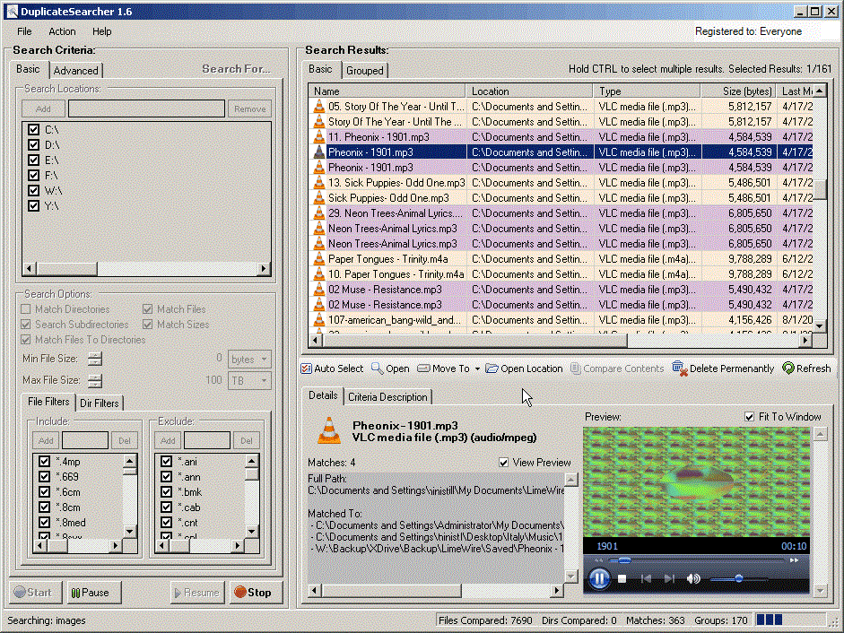
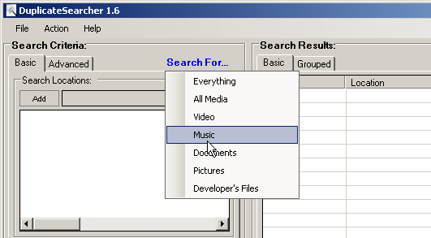
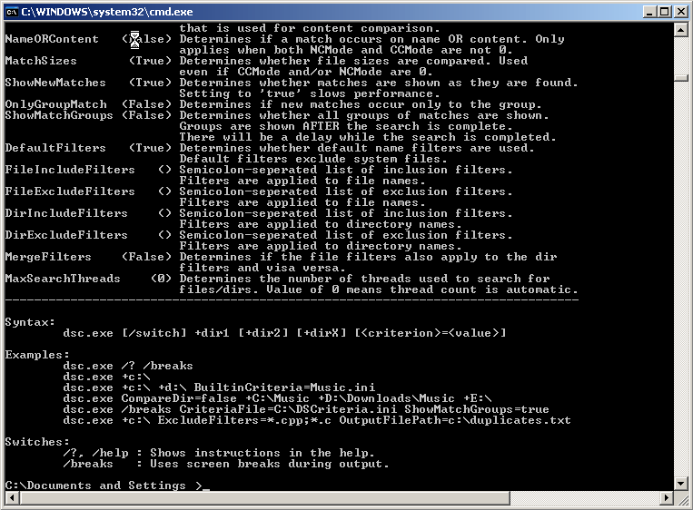
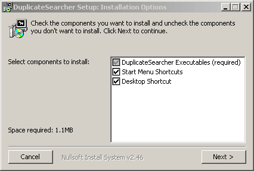

# DuplicateSearcher
DuplicateSearcher is a Windows desktop application that I developed over 10 years ago. It finds duplicate files on file systems. It has both a GUI and CLI. 

One goal of DuplicateSearcher was to generate results that could be used by other applications. The process of identifying duplicates can be complex and time-consuming. There are many attributes of files and directories that can be compared, and the criteria for identifying a duplicate often depends on the file's type and contents. DuplicateSearcher enables the user to specify fairly extensive criteria for identifying duplicate files and directories.

DuplicateSearcher has two operating modes: console and Graphical User Interface (GUI). The console's executable file is dsc.exe, and the GUI's
executable file is dsgui.exe. Both have the same search capabilities; however, only the GUI supports performing operations on duplicates, such as deleting, moving, or recycling. 

The GUI makes the criteria easier to specify, and the search results are easier to view. The console makes it easier to integrate the functionality of DuplicateSearcher with other applications. For example, the output from the console could be redirected to a file that is processed by a separate application.

# Download And Install
The installer can be downloaded here: [DS_Setup.exe](Installer/DS_Setup.exe)

The installer was built using Nullsoft's NSIS, and the code for the installer is included in this repo.

# How It Works
DuplicateSearcher uses a combination of multithreading, data structures, and various search algorithms to minimize the time it takes to find duplicates and present them to the user. Internally, DuplicateSearcher creates a 'tag' for each file and directory. Depending on the specified search criteria, this 'tag' can be a combination of a file or directory's attributes, including, but not limited to, its name (exact or SOUNDEX), size, header, footer, or hash of the contents. The 'tag' is used to organize the files and directories using a self-balancing AVL binary search tree (BST). As the file system is searched, references to files and directories are added to the BST using the generated 'tag'. 

DuplicateSearcher employs multiple threads to maximize search speed. By default, DuplicateSearcher will assign one thread to each search location. As a general rule, peripheral I/O (such as access to hard drives and network controllers) is slower than the CPU and system memory. Instead of making DuplicateSearcher wait on various peripherals, it is almost always faster to attempt concurrent access to multiple peripheral devices using multiple threads. Nevertheless, there are some cases where concurrent access to peripheral devices might make the search process slower, such as if one hard drive contains multiple partitions. DuplicateSearcher allows the user to specify a maximum thread count.  

# How To Use It
Download and run the [installer](Installer/DS_Setup.exe). Start the GUI, or use the CLI in the installation directory. Both the GUI and CLI are stand-alone applications (besides their dependencies on .NET 2.0 CLR assemblies), so they can be copied anywhere, such as the Windows system directory, so that they can be easily run from the command prompt.

# Build
DuplicateSearcher was written using Visual Studio. It can be compiled using the Community edition. 

# Motivation
I wrote DuplicateSearcher to get more experience with developing an application that can be installed and run by anyone. My skills have improved since I wrote it, so there's a lot that I would do differently now. 

# To Do
## Version 1:
- ensure hard links are not considered
- make a more simplified interface
- use tree view to both group and list results
- title shows progress too (1%... 100%)
- registration system
- auto updates

## Version 2:
- Stay-resident version (sys tray) that notifies the user of duplicates when they are placed on the file system
- have dialog for content comparison of multiple (>2) selected results
- set thread priority
- restructure engine
- allow for matching on more FileSystemInfo attributes
- restructure the whole search engine/model to support additional matching criteria using Dictionary<> of multiple attributes
- allow for sort on the results columns
- improved licensing that uses RSA
